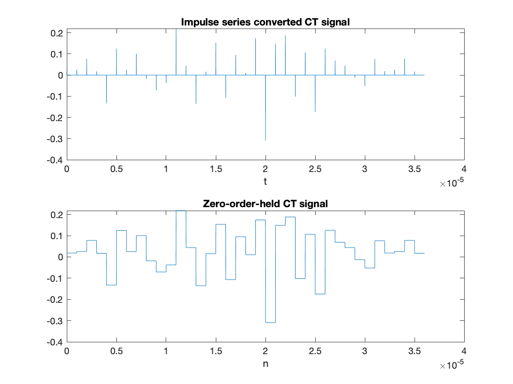
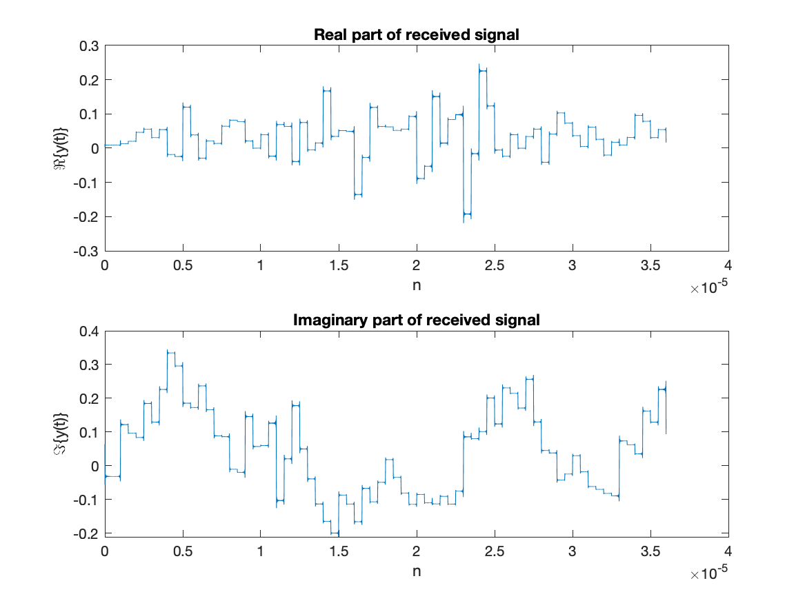

# Report of Signals and Systems Lab Project 2

The report for the first project of Signals and Systems lab session, written by following team members:

- HUANG Guanchao, SID 11912309 from SME
- GONG Xinrui, SID 11911233 from BME
- XUE Feng, SID 11913020 from MEE
- HE Xinyi, SID 11911234 from BME

The complete resources, including report in `.pdf` and `.md` format, as well as all MATLAB scripts, can be retrieved at [our GitHub repo](https://github.com/SamuelHuang2019/ss-project).

[toc]

---

## Abstract

In this project, we implemented the whole process of OFDM in signal transmission with MATLAB.

## Introduction

---

## Background

---

## Receiver Design and Analysis

---

## Simulations

We first create a signal as follows:

```matlab
% set real and imaginary part of signal
xr = sqrt(2) * round(rand(1, N)) - sqrt(2) / 2; 
xi = sqrt(2) * round(rand(1, N)) - sqrt(2) / 2;
```

The plot for our signal is as below.


Then we use `ifft()` to produce the signal in time domain.  


After that we add `cp` with length of 4 to this signal.


To make our signal discrete, we first produce the impulse result of OFDM signal and then use square signal to simulate it.



Then we add carrier signal to the OFDM signal.


After that, we simulate the process of real wireless channel.


Then the signal experience a process of demodulation and pass through a LPF.



Sampling:


Then we remove cp.


Then we can recover X since `X_recover_N=Y_recover_N./H;`


---

## Discussions

---

## Appendix


